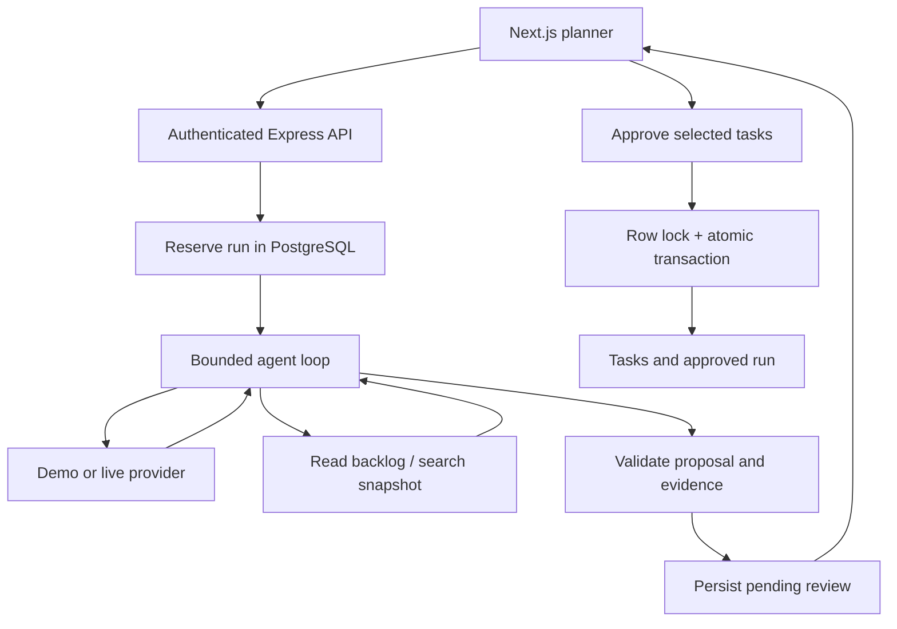

# SprintPilot architecture

## State and invariants

Runs transition from `running` to `pending_review` or `failed`; review transitions to `approved` or `rejected`. Stored plans and activity survive browser reloads and API restarts. Reservations older than three minutes are marked failed when that account next requests a run. A crash does not automatically replay a model call.

Run creation locks the account row, checks a unique request ID and input hash, enforces one active run and ten runs/account/hour, then releases the transaction before calling the model. Approval locks the run row and writes selected tasks plus status in one transaction. Repeated identical approvals return the original task IDs; changed selections after approval return 409. Selected tasks must include their prerequisites.

The agent sees the latest 100 tasks owned by the caller. Task descriptions are truncated to 600 characters. Tool evidence is a snapshot: it can become stale between planning and approval. Referenced IDs must exist in retrieved evidence, but semantic relevance and duplicates still need human review. Dependencies are zero-based indices pointing backward, which makes cycles impossible; approved task descriptions reference actual created task IDs.

## Limits and privacy

- Six model turns, twelve tool calls, 90 seconds total provider deadline, 3,500 maximum output tokens per call.
- A 30,000 observed-token budget is checked after each response, so the final response can cross it. It is not a hard dollar-spend ceiling.
- Live inference requires both `ANTHROPIC_API_KEY` and `ANTHROPIC_MODEL`; demo is an explicitly labeled deterministic template, never a silent live fallback.
- Live mode sends the goal and retrieved backlog text to Anthropic. Keys remain on the server. No arbitrary outbound URLs, shell execution, repository access, messages, or application submissions are agent tools.
- User-entered text is rendered as escaped React text. Tool input uses Zod; SQL uses parameters; every run/backlog query is scoped by authenticated user ID.
- Activity records tool summaries, not hidden model reasoning. Raw upstream error bodies are not returned or persisted.
- Runs persist goals, plans, and the bounded evidence snapshot. Account deletion cascades; there is no dedicated run-deletion UI yet.

## Scope boundaries

This MVP uses synchronous HTTP requests for runs. For public production use, add an authenticated job queue, SSE/polling, server-wide spending limits, abuse controls on registration, and a retention/deletion policy. PGlite tests exercise PostgreSQL SQL and rollback, but do not simulate contention between independent production connections. A multi-connection PostgreSQL concurrency check remains a deployment gate.

The existing app stores the session token in component memory: a refresh requires signing in again, after which run history is available. Approval creates task descriptions containing prerequisites; it does not enforce task-completion order. There is no GitHub issue import or automatic code editing in this version.
